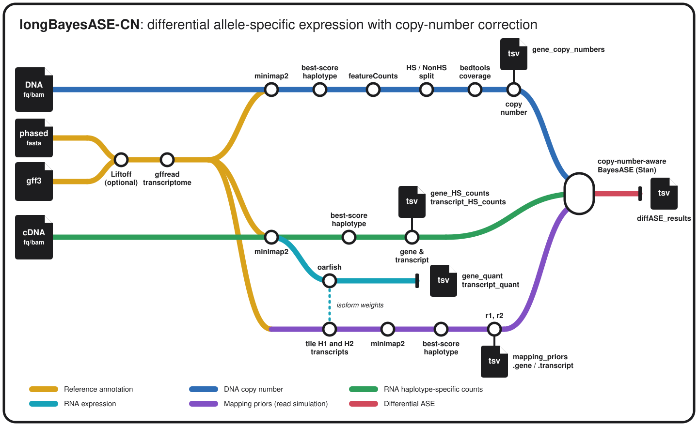

# longBayesASE-CN

[](https://www.nextflow.io/)
[](https://github.com/pabloangulo7/longBayesASE-CN/actions/workflows/ci.yml)
[](LICENSE)

`longBayesASE-CN` is a long-read-specific pipeline for analysing differential allele-specific expression between conditions while accounting for gene copy number and supporting personalized haplotype-resolved assemblies. The pipeline annotates and characterizes the personalized reference assembly, quantifies haplotype-specific RNA expression and DNA copy number, and integrates both measurements into an adaptation of the BayesASE model developed by León-Novelo et al., 2018. This approach identifies differential allele-specific expression events that cannot be explained solely by differences in gene dosage.

The pipeline needs:

- a haplotype-resolved FASTA (contigs must end in `_hap1` or `_hap2`);
- a GFF3 annotation for the assembly, or source annotation files to perform a lift over;
- sample info file;
- one or more contrasts, for example `Aneuploid:Control`.

FASTQ and uBAM inputs are aligned by the pipeline. A DNA BAM already aligned to the diploid genome or an RNA BAM already aligned to the diploid transcriptome skips minimap2 automatically.

## Workflow



## Quick start

Install Nextflow 24.10 or newer and use Docker, Singularity/Apptainer or Conda.

If the diploid assembly is already annotated:

```bash
nextflow run pabloangulo7/longBayesASE-CN \
  -profile singularity \
  --samplesheet samples.tsv \
  --fasta assembly.fa \
  --gff3 assembly.gff3 \
  --contrast Aneuploid:Control \
  --outdir results
```

If the assembly still needs to be annotated, replace `--gff3` with the source genome and annotation:

```bash
--source_fasta GRCh38.fa --source_gff3 gencode.gff3
```

The default `--step all` runs annotation preparation, DNA, RNA, mapping-prior simulation and diffASE. Nextflow resumes completed work with `-resume`.

### Main parameters

| Parameter | Meaning |
|---|---|
| `--samplesheet` | Sample metadata and DNA/RNA paths. |
| `--fasta` | Personalized diploid assembly. Contigs must end in `_hap1` or `_hap2`. |
| `--gff3` | Annotation already mapped to the personalized assembly. |
| `--source_fasta`, `--source_gff3` | Reference genome and annotation used by Liftoff when `--gff3` is not available. |
| `--contrast` | Conditions to compare, written as `conditionA:conditionB`. Several contrasts may be listed separated by commas. |
| `--level` | `gene` (default) or `transcript`: the features the differential test is run on. |
| `--outdir` | Output directory; default: `results`. |
| `--step` | `all`, `annotation`, `dna`, `rna` or `diffase`; default: `all`. |

### Samplesheet

The header must contain exactly these six columns:

```text
sample	condition	dna_id	rna	dna	ploidy
Sample1_R1	Control	Sample1	/data/Sample1_R1.fastq.gz	/data/Sample1.ubam	
Sample1_R2	Control	Sample1	/data/Sample1_R2.bam	/data/Sample1.genome.bam	
Sample2_R1	Aneuploid	Sample2	/data/Sample2_R1.fastq.gz	/data/Sample2.fastq.gz	chr7:2:1;chr22:1:2
```

- `sample`: unique RNA library name.
- `condition`: group used in `--contrast`.
- `dna_id`: DNA specimen associated with the RNA library. Replicate RNA libraries may share it.
- `rna`: cDNA FASTQ, uBAM or transcriptome-aligned BAM.
- `dna`: gDNA FASTQ, uBAM or diploid-genome-aligned BAM. It may be empty when copy number is supplied separately or defined by `ploidy`.
- `ploidy`: known exceptions to the default H1=1, H2=1, written as `chromosome:CN_H1:CN_H2` and separated by semicolons. Leave it empty for a normal diploid sample.

Multiple raw read files for one library may be separated with semicolons. An aligned BAM must be a single file. `assets/samplesheet.example.tsv` is a filled-in copy to start from.

### Main outputs

| File | Contents |
|---|---|
| `reference/` | Diploid GFF3, gene BED/SAF, transcriptomes and annotation summary. |
| `dna/gene_copy_numbers.tsv` | `sample`, gene `ID`, chromosome, `CN_H1`, `CN_H2`. |
| `rna/gene_HS_counts.tsv` | `sample`, gene `ID`, `H1`, `H2`, `NonHS`: haplotype-specific counts for the allele-specific model. |
| `rna/transcript_HS_counts.tsv` | The same per transcript. |
| `rna/gene_quant.tsv` | `sample`, gene `ID`, `num_reads`: Oarfish expression with both haplotypes summed, for differential expression. |
| `rna/transcript_quant.tsv` | The same per transcript, for isoform usage. |
| `rna/gene_read_intervals.tsv.gz` | Where the counted reads lie on their transcripts (`sample`, gene `ID`, `transcript`, `start`, `end`): a sample of up to `--prior_reads` per gene, from which the mapping priors are simulated. |
| `rna/transcript_read_intervals.tsv.gz` | The same per transcript. |
| `rna/counts/` | Per-library haplotype-specific counts with every read category, read groups and QC. |
| `rna/oarfish/` | Oarfish output per library, including the unique/ambiguous read counts (`*.ambig_info.tsv`) and, with `--oarfish_bootstraps`, the inferential replicates (`*.infreps.pq`). |
| `priors/mapping_priors.gene.tsv` | Per-gene H1 and H2 mapping probabilities, with the simulated reads behind each (`n_hap1`, `n_hap2`). With `--level transcript`, `mapping_priors.transcript.tsv` per transcript instead. |
| `diffase/diffASE_results.tsv` | Allelic imbalance per condition, differential ASE, p-values, ROPE and fit status (columns described under [Result columns](#result-columns)). |

## Run one part of the pipeline

### Annotation

Build all reference files from an existing diploid GFF3:

```bash
nextflow run pabloangulo7/longBayesASE-CN -profile singularity \
  --step annotation --fasta assembly.fa --gff3 assembly.gff3 --outdir results
```

If the diploid assembly is not annotated, use `--source_fasta` and `--source_gff3` instead of `--gff3` to lift the annotation over with Liftoff. The main output is `results/reference/`.

### DNA

```bash
nextflow run pabloangulo7/longBayesASE-CN -profile singularity \
  --step dna --samplesheet samples.tsv --fasta assembly.fa --gff3 assembly.gff3 \
  --outdir results
```

FASTQ/uBAM is aligned to `assembly.fa`; a `.bam` in the DNA column is used directly. The main output is `dna/gene_copy_numbers.tsv`.

Two options shape the estimate:

| Parameter | Options |
|---|---|
| `--copy_number_level` | `chromosome` (default) gives every gene on a chromosome the same value, the median over its genes. `gene` estimates each gene from its own depth, which is noisier. |
| `--gene_copies` | `all` (default) adds up the coverage of every copy Liftoff annotated for a gene. `primary` keeps only the canonical locus. |

Only genes annotated as a single copy in both haplotypes are used for the diploid baseline and the per-chromosome medians.

### RNA

```bash
nextflow run pabloangulo7/longBayesASE-CN -profile singularity \
  --step rna --samplesheet samples.tsv --fasta assembly.fa --gff3 assembly.gff3 \
  --outdir results
```

FASTQ/uBAM is aligned to the generated diploid transcriptome; a `.bam` in the RNA column is used directly and must keep every alignment of a read together, as minimap2 writes it, not sorted by coordinate.

The alignments are used for:

- **Haplotype-specific counts** (`rna/gene_HS_counts.tsv`, `rna/transcript_HS_counts.tsv`). A read is H1 or H2 when all the alignments that reach its best score fall on one haplotype, and NonHS when both haplotypes explain it equally well. Reads whose best alignments fall on several features are kept in the multigene and complex categories of `rna/counts/` and left out of the model.
- **Read intervals** (`rna/gene_read_intervals.tsv.gz`, `rna/transcript_read_intervals.tsv.gz`): the start and end on its transcript of a random sample of the counted reads, up to `--prior_reads` per feature split equally among the libraries. Each level is sampled on its own, so a minor isoform of a highly expressed gene keeps its own intervals. The mapping priors are simulated from them.
- **Expression** (`rna/gene_quant.tsv`, `rna/transcript_quant.tsv`) from Oarfish, with the two haplotypes of every transcript summed. For transcript-level differential expression or isoform usage, `--oarfish_bootstraps` adds inferential replicates that carry the quantification uncertainty into those analyses.

### Differential ASE

Fits the model to the RNA counts, corrected by gene copy number and by the mapping priors. Each contrast compares two conditions as they appear in the samplesheet:

```bash
nextflow run pabloangulo7/longBayesASE-CN -profile singularity \
  --step diffase \
  --level gene \
  --samplesheet samples.tsv \
  --hs_counts results/rna/gene_HS_counts.tsv \
  --read_intervals results/rna/gene_read_intervals.tsv.gz \
  --copy_number results/dna/gene_copy_numbers.tsv \
  --fasta assembly.fa --gff3 assembly.gff3 \
  --contrast Aneuploid:Control \
  --outdir diffase_results
```

Results go to `diffase/diffASE_results.tsv`, where the `test` column names the comparison each row belongs to.

#### Mapping priors

The priors are the `r1` and `r2` of the model: the probability that a read from H1 (or H2) is recognised as haplotype-specific. It depends on whether the read covers a heterozygous site, so on the isoforms a gene uses and on where on them its reads start and end. Each read interval of the analysis level (`rna/gene_read_intervals.tsv.gz` or `rna/transcript_read_intervals.tsv.gz`) is cut from the H1 copy and from the H2 copy of its transcript, both sets are aligned to the diploid transcriptome with the same settings as the real reads and classified by the same rule: `r1` is the fraction of the reads simulated from H1 that come out as H1, and `r2` the same for H2. Only the positions of the real reads are used, never their alleles, and the intervals are pooled over all libraries, so every condition gets the same priors.

| You supply | What happens |
|---|---|
| `--priors mapping_priors.gene.tsv` | Used as given. |
| `--read_intervals gene_read_intervals.tsv.gz` | Simulated from these intervals, which must be of the same `--level`. Needs `--fasta` and `--gff3` to rebuild the transcriptome. |

`--step all` simulates them from its own read intervals. A feature needs at least `--min_prior_reads` (10) simulated reads per haplotype, one per real read interval, to get a prior; `n_hap1` and `n_hap2` in the table tell how many each prior rests on. Features below that have too few reads for the model to fit them anyway.

#### Copy number

| You supply | What happens |
|---|---|
| `--copy_number gene_copy_numbers.tsv` | Used as given. It takes priority over the `ploidy` column. |
| the samplesheet `ploidy` column | Expanded to every gene on the chromosomes listed there. |
| neither | Every gene is treated as diploid, H1=1 and H2=1. |

#### Gene or transcript level

The RNA step writes both tables and `--level` decides which one is tested: `gene` (the default) or `transcript`. Run on its own, pass the tables of that level:

```bash
  --level transcript \
  --hs_counts results/rna/transcript_HS_counts.tsv \
  --read_intervals results/rna/transcript_read_intervals.tsv.gz
```

Copy number is always measured per gene and reaches transcripts through the transcript-to-gene map. The priors are simulated for the level being tested only, from that level's read intervals.

A read compatible with several isoforms of one gene is left out at transcript level but kept at gene level, so transcript-level counts are lower.

#### Counts and copy number in one table

```text
sample	ID	H1	H2	NonHS	CN_H1	CN_H2
Sample1_R1	GENE1	30	28	12	1	1
Sample2_R1	GENE1	54	25	15	2	1
```

Pass it with `--counts combined_counts.tsv` instead of `--hs_counts` and `--copy_number`. The small files in `examples/toy_ase/` run this way without any sequencing data:

```bash
nextflow run . -profile conda \
  --step diffase \
  --samplesheet examples/toy_ase/samplesheet.tsv \
  --counts examples/toy_ase/combined_counts.tsv \
  --priors examples/toy_ase/mapping_priors.gene.tsv \
  --contrast Treatment:Control \
  --outdir toy_results
```

## Optional parameters

Most analyses only need the parameters above.

| Parameter | Default | Purpose |
|---|---:|---|
| `--rna_strand` | `fw` | Orientation a cDNA read must have on its transcript: `fw` for oriented ONT cDNA, `rc` or `both`. Applies to the haplotype counts and to Oarfish. |
| `--oarfish_score` | `1.0` | Fraction of a read's best alignment score an alignment needs for Oarfish to consider it. |
| `--oarfish_bootstraps` | `0` | Oarfish inferential replicates, for uncertainty-aware transcript-level analyses (for example `30`). |
| `--copy_number_level` | `chromosome` | `chromosome` or `gene`. |
| `--cn_change_threshold` | `1.2` | Fold change from the diploid baseline, in either direction, that makes a chromosome aneuploid. |
| `--gene_copies` | `all` | `all` sums the coverage of every copy Liftoff found for a gene; `primary` keeps only the canonical locus. |
| `--min_haplotype_depth` | `10` | Haplotype-specific depth a gene needs before its own H1/H2 split is trusted; below it the gene borrows its chromosome's proportion. |
| `--min_gene_depth` | `1` | Total depth a gene needs before its own copy number is estimated with `--copy_number_level gene`. |
| `--prior_reads` | `2000` | Read intervals kept per feature for the mapping priors, split equally among the libraries. Set in the RNA step. |
| `--min_prior_reads` | `10` | Simulated reads per haplotype a feature needs to get a prior. |
| `--ase_shards` | `100` | Parallel groups of genes fitted by Stan, per contrast. |
| `--ase_iterations` | `100000` | Stan iterations per gene. |
| `--ase_warmup` | `10000` | Stan warmup iterations. |
| `--seed` | `1701` | Random seed for the Stan sampler. |
| `--max_cpus` | `16` | Maximum CPUs assigned to one process. |
| `--max_memory` | `120.GB` | Maximum memory assigned to one process. |
| `--max_time` | `72.h` | Maximum walltime assigned to one process. |

For a Slurm cluster, add `-profile singularity,slurm`. Resource requests can be changed in a small Nextflow config without modifying the pipeline.

## Differential ASE model

For each condition, the copy-number-aware model describes the expected counts as:

```text
H1:     CN_H1 × (1/alpha) × r1 × beta
H2:     CN_H2 × alpha     × r2 × beta
NonHS: [CN_H1 × (1-r1)/alpha + CN_H2 × (1-r2) × alpha] × beta
theta:  1 / (alpha² + 1)
```

`CN_H1` and `CN_H2` correct for haplotype dosage. `r1` and `r2` are the simulated mapping probabilities: their ratio corrects mapping bias between the haplotypes, and their level sets how many reads the model expects in NonHS. `alpha=1` and `theta=0.5` indicate balanced per-copy expression, so a gene whose expression follows its dosage has `theta=0.5` in every condition and is not differential.

`thetaRaw` puts the group's copy number back into `theta`:

```text
thetaRaw = CN_H1 × theta / (CN_H1 × theta + CN_H2 × (1 - theta))
```

It is the H1 share of the gene's expression, the allelic balance the libraries show. It is computed from the same posterior draws, so no second model is fitted, and it equals `theta` where both haplotypes have one copy. On a gained chromosome with `CN_H1=2`, a gene that follows its dosage has `theta=0.5` and `thetaRaw=2/3`; a gene with `delta_theta` significant against the gained haplotype and a `thetaRaw` close to that of the control group has had its extra copy compensated on that allele.

### Result columns

| Columns | Meaning |
|---|---|
| `test`, `groupA`, `groupB` | The contrast; `groupA` is the first condition written in `--contrast`. |
| `groupX_CN_H1`, `groupX_CN_H2` | Mean copy number of each haplotype in the group. |
| `groupX_priorH1`, `groupX_priorH2` | Mapping priors `r1` and `r2`. |
| `groupX_totalH1/H2/NonHS`, `groupX_meanH1/H2/NonHS` | Reads per category, summed and averaged over the group's libraries. |
| `groupX_alpha_mean` | Posterior mean of `alpha`. |
| `groupX_theta_mean`, `_q025`, `_q975` | Per-copy H1 share, with its 95% credible interval. |
| `groupX_thetaRaw_mean`, `_q025`, `_q975` | H1 share of the expression, not divided by copy number, with its 95% credible interval. |
| `groupX_alphaAI_pvalue`, `groupX_thetaAI_pvalue` | Allelic imbalance within the group (`alpha≠1`, `theta≠0.5`). |
| `delta_theta_mean`, `delta_thetaRaw_mean`, `delta_alpha_mean` | Differences between the groups, A minus B. |
| `diffAI_pvalue` | Differential allelic imbalance between the groups, corrected by copy number. |
| `rope_value` | Posterior probability that the groups differ by less than 0.15 in `theta`. |
| `analysis_flag` | `Success`; `pvalue0` when every posterior draw put the same group ahead, so the p-value is below what the draws can resolve; `Skipped_Low_Counts`; or the error. |

## Citation

The differential ASE model is adapted from:

- León-Novelo L. et al. (2018), *Direct Testing for Allele-Specific Expression Differences Between Conditions*, G3. [doi:10.1534/g3.117.300139](https://doi.org/10.1534/g3.117.300139)
- Miller B.R. et al. (2021), *Testcrosses are an efficient strategy for identifying cis-regulatory variation: Bayesian analysis of allele-specific expression (BayesASE)*, G3. [doi:10.1093/g3journal/jkab096](https://doi.org/10.1093/g3journal/jkab096)

Also cite the sequencing and analysis tools used in your run, including Liftoff, gffread, minimap2, samtools, bedtools, featureCounts, Oarfish, Stan/RStan and Nextflow.

## License

MIT. See [LICENSE](LICENSE).
