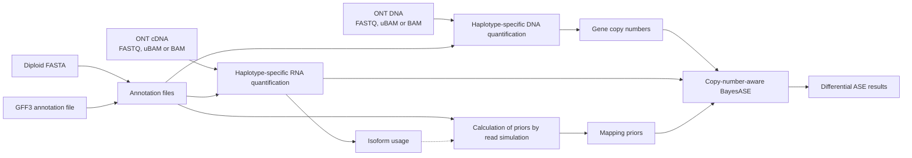

# longBayesASE-CN

[](https://www.nextflow.io/)
[](https://github.com/pabloangulo7/longBayesASE-CN/actions/workflows/ci.yml)
[](LICENSE)

`longBayesASE-CN` is a long-read-specific pipeline for analysing differential allele-specific expression between conditions while accounting for gene copy number and supporting personalized haplotype-resolved assemblies. The pipeline annotates and characterizes the personalized reference assembly, quantifies haplotype-specific RNA expression and DNA copy number, and integrates both measurements into an adaptation of the BayesASE model developed by León-Novelo et al., 2018. This approach identifies differential allele-specific expression events that cannot be explained solely by differences in gene dosage.

The pipeline needs:

- a haplotype-resolved FASTA (contigs must end in `_hap1` or `_hap2`);
- a GFF3 annotation for the assembly, or source annotation files to perform a lift over;
- sample info file;
- one or more contrasts, for example `Aneuploid:Control`.

FASTQ and uBAM inputs are aligned by the pipeline. A DNA BAM already aligned to the diploid genome or an RNA BAM already aligned to the diploid transcriptome skips minimap2 automatically.

## Workflow



## Quick start

Install Nextflow 24.10 or newer and use Docker, Singularity/Apptainer or Conda.

If the diploid assembly is already annotated:

```bash
nextflow run pabloangulo7/longBayesASE-CN \
  -profile singularity \
  --samplesheet samples.tsv \
  --fasta assembly.fa \
  --gff3 assembly.gff3 \
  --contrast Aneuploid:Control \
  --outdir results
```

If the assembly still needs to be annotated, replace `--gff3` with the source genome and annotation:

```bash
--source_fasta GRCh38.fa --source_gff3 gencode.gff3
```

The default `--step all` runs annotation preparation, DNA, RNA, mapping-prior simulation and diffASE. Nextflow resumes completed work with `-resume`.

### Main parameters

| Parameter | Meaning |
|---|---|
| `--samplesheet` | Sample metadata and DNA/RNA paths. |
| `--fasta` | Personalized diploid assembly. Contigs must end in `_hap1` or `_hap2`. |
| `--gff3` | Annotation already mapped to the personalized assembly. |
| `--source_fasta`, `--source_gff3` | Reference genome and annotation used by Liftoff when `--gff3` is not available. |
| `--contrast` | Conditions to compare, written as `conditionA:conditionB`. Several contrasts may be listed separated by commas. |
| `--level` | `gene` (default) or `isoform`: the features the differential test is run on. |
| `--outdir` | Output directory; default: `results`. |
| `--step` | `all`, `annotation`, `dna`, `rna` or `diffase`; default: `all`. |

### Samplesheet

The header must contain exactly these six columns:

```text
sample	condition	dna_id	rna	dna	ploidy
Sample1_R1	Control	Sample1	/data/Sample1_R1.fastq.gz	/data/Sample1.ubam	
Sample1_R2	Control	Sample1	/data/Sample1_R2.bam	/data/Sample1.genome.bam	
Sample2_R1	Aneuploid	Sample2	/data/Sample2_R1.fastq.gz	/data/Sample2.fastq.gz	chr7:2:1;chr22:1:2
```

- `sample`: unique RNA library name.
- `condition`: group used in `--contrast`.
- `dna_id`: DNA specimen associated with the RNA library. Replicate RNA libraries may share it.
- `rna`: cDNA FASTQ, uBAM or transcriptome-aligned BAM.
- `dna`: gDNA FASTQ, uBAM or diploid-genome-aligned BAM. It may be empty when copy number is supplied separately or defined by `ploidy`.
- `ploidy`: known exceptions to the default H1=1, H2=1, written as `chromosome:CN_H1:CN_H2` and separated by semicolons. Leave it empty for a normal diploid sample.

Multiple raw read files for one library may be separated with semicolons. An aligned BAM must be a single file. `assets/samplesheet.example.tsv` is a filled-in copy to start from.

### Main outputs

| File | Contents |
|---|---|
| `reference/` | Diploid GFF3, gene BED/SAF, transcriptomes and annotation summary. |
| `dna/gene_copy_numbers.tsv` | `sample`, gene `ID`, chromosome, `CN_H1`, `CN_H2`. |
| `rna/gene_counts.tsv` | `sample`, gene `ID`, `H1`, `H2`, `NonHS`. |
| `rna/isoform_counts.tsv` | The same table at isoform level. |
| `priors/mapping_priors.tsv` | Per-gene H1 and H2 mapping probabilities. The header records how the tiles were weighted. |
| `priors/mapping_priors.isoforms.tsv` | The same probabilities per isoform, for isoform-level analyses. |
| `diffase/longBayesASE-CN.results.tsv` | Allelic imbalance, differential ASE, p-values, ROPE and fit status. |

## Run one part of the pipeline

### Annotation

Build all reference files from an existing diploid GFF3:

```bash
nextflow run pabloangulo7/longBayesASE-CN -profile singularity \
  --step annotation --fasta assembly.fa --gff3 assembly.gff3 --outdir results
```

If diploid assembly is not annotated, use `--source_fasta` and `--source_gff3` instead of `--gff3` for liftover step with liftoff. The main output is `results/reference/`.

### DNA

```bash
nextflow run pabloangulo7/longBayesASE-CN -profile singularity \
  --step dna --samplesheet samples.tsv --fasta assembly.fa --gff3 assembly.gff3 \
  --outdir results
```

FASTQ/uBAM is aligned to `assembly.fa`; a `.bam` in the DNA column is used directly. The main output is `dna/gene_copy_numbers.tsv`.

Two options shape the estimate:

| Parameter | Options |
|---|---|
| `--copy_number_level` | `chromosome` (default) gives every gene on a chromosome the same value, the median over its genes. `gene` estimates each gene from its own depth, which is considerably noisier. |
| `--gene_copies` | `all` (default) adds up the coverage of every copy Liftoff annotated for a gene, which measures how many copies of that sequence the genome carries. `primary` keeps only the canonical locus. |

Only genes annotated as a single copy in both haplotypes enter the diploid baseline and the per-chromosome medians, because a gene with several copies splits its reads among them and its coverage no longer measures a dosage.

### RNA

```bash
nextflow run pabloangulo7/longBayesASE-CN -profile singularity \
  --step rna --samplesheet samples.tsv --fasta assembly.fa --gff3 assembly.gff3 \
  --outdir results
```

FASTQ/uBAM is aligned to the generated diploid transcriptome; a `.bam` in the RNA column is used directly. The outputs are `rna/gene_counts.tsv` and `rna/isoform_counts.tsv`, both with the columns `sample`, `ID`, `H1`, `H2`, `NonHS`.

### Differential ASE

Fits the model to the RNA counts, corrected by gene copy number and by the mapping priors. Each contrast compares two conditions as they appear in the samplesheet:

```bash
nextflow run pabloangulo7/longBayesASE-CN -profile singularity \
  --step diffase \
  --samplesheet samples.tsv \
  --rna_counts results/rna/gene_counts.tsv \
  --isoform_usage results/rna/isoform_counts.tsv \
  --copy_number results/dna/gene_copy_numbers.tsv \
  --fasta assembly.fa --gff3 assembly.gff3 \
  --contrast Aneuploid:Control \
  --outdir diffase_results
```

Results go to `diffase/longBayesASE-CN.results.tsv`, where the `test` column names the comparison each row belongs to.

#### Mapping priors

| You supply | What happens |
|---|---|
| `--priors mapping_priors.tsv` | Used as given. |
| nothing | Simulated from the annotation. A gene's probability is the average over its isoforms, weighted by their length. |
| `--isoform_usage isoform_counts.tsv` | Simulated and weighted by how much each isoform is expressed instead of by its length. |

`--step all` weights by expression on its own, because `rna/isoform_counts.tsv` is produced along the way. The usage table is summed over every sample before it is used: a prior built from one condition would no longer cancel out of the differential test.

#### Copy number

| You supply | What happens |
|---|---|
| `--copy_number gene_copy_numbers.tsv` | Used as given. It takes priority over the `ploidy` column. |
| the samplesheet `ploidy` column | Expanded to every gene on the chromosomes listed there. |
| neither | Every gene is treated as diploid, H1=1 and H2=1. |

#### Gene or isoform level

The RNA step writes both tables and `--level` decides which one is tested: `gene` (the default) or `isoform`. Run on its own, pass the tables of the level asked for:

```bash
  --level isoform \
  --rna_counts results/rna/isoform_counts.tsv \
  --priors results/priors/mapping_priors.isoforms.tsv
```

Copy number is always measured per gene, and isoform-level counts reach it through the transcript-to-gene map. Weighting by isoform usage does not apply at this level: an isoform's probability comes from its own tiles and is never averaged with the other isoforms of its gene.

A read compatible with several isoforms of one gene is counted as multi-feature and dropped, whereas at gene level that same read collapses onto one gene and is kept. Isoform counts are therefore much lower and the test has less power. The simulated tiles pass through the same filter, so the priors stay consistent with the data; there is simply less of it.

#### Counts and copy number in one table

```text
sample	ID	H1	H2	NonHS	CN_H1	CN_H2
Sample1_R1	GENE1	30	28	12	1	1
Sample2_R1	GENE1	54	25	15	2	1
```

Pass it with `--counts combined_counts.tsv` instead of `--rna_counts` and `--copy_number`. The small files in `examples/toy_ase/` run this way without any sequencing data:

```bash
nextflow run . -profile conda \
  --step diffase \
  --samplesheet examples/toy_ase/samplesheet.tsv \
  --counts examples/toy_ase/combined_counts.tsv \
  --priors examples/toy_ase/mapping_priors.tsv \
  --contrast Treatment:Control \
  --outdir toy_results
```

## Optional parameters

Defaults reproduce the implemented workflow. Most analyses only need the parameters above.

| Parameter | Default | Purpose |
|---|---:|---|
| `--rna_probability` | `0.90` | Probability required to resolve a read to one gene or isoform. |
| `--oarfish_score` | `1.0` | Oarfish alignment-score threshold. |
| `--oarfish_display_threshold` | `0.001` | Minimum assignment probability written by Oarfish. |
| `--oarfish_strand` | `fw` | Strand used for oriented ONT cDNA. |
| `--copy_number_level` | `chromosome` | `chromosome` or `gene`. |
| `--cn_change_threshold` | `1.2` | Fold change from the diploid baseline, in either direction, that makes a chromosome aneuploid. |
| `--gene_copies` | `all` | `all` sums the coverage of every copy Liftoff found for a gene; `primary` keeps only the canonical locus. |
| `--min_haplotype_depth` | `10` | Haplotype-specific depth a gene needs before its own H1/H2 split is trusted; below it the gene borrows its chromosome's proportion. |
| `--min_gene_depth` | `1` | Total depth a gene needs before its own copy number is estimated with `--copy_number_level gene`. |
| `--tiling_read_length` | `1000` | Simulated transcript-tile length. |
| `--tiling_step` | `100` | Distance between consecutive tiles. |
| `--min_simulated_reads` | `1` | Simulated reads a gene needs before it gets a prior. The tiling is exhaustive, not a sample, so a low count means few possible start positions rather than a noisy estimate: a transcript shorter than the read length has exactly one. Raising it drops short genes, and the prior table reports `n_hap1` and `n_hap2` for filtering afterwards instead. |
| `--isoform_usage` | – | Isoform count table used to weight the tiling by expression. |
| `--tiling_max_replicates` | `3` | Maximum tile replicates for the dominant isoform of a gene when weighting is on. |
| `--ase_shards` | `100` | Parallel groups of genes fitted by Stan, per contrast. |
| `--ase_iterations` | `100000` | Stan iterations per gene. |
| `--ase_warmup` | `10000` | Stan warmup iterations. |
| `--seed` | `1701` | Random seed for the Stan sampler. |
| `--max_cpus` | `16` | Maximum CPUs assigned to one process. |
| `--max_memory` | `120.GB` | Maximum memory assigned to one process. |
| `--max_time` | `72.h` | Maximum walltime assigned to one process. |

For a Slurm cluster, add `-profile singularity,slurm`. Resource requests can be changed in a small Nextflow config without modifying the pipeline.

## Differential ASE model

For each condition, the copy-number-aware model describes the expected counts as:

```text
H1:     CN_H1 × (1/alpha) × r1 × beta
H2:     CN_H2 × alpha     × r2 × beta
NonHS: [CN_H1 × (1-r1)/alpha + CN_H2 × (1-r2) × alpha] × beta
theta:  1 / (alpha² + 1)
```

`CN_H1` and `CN_H2` correct for haplotype dosage. `r1` and `r2` are the simulated mapping probabilities. `alpha=1` and `theta=0.5` indicate balanced per-copy expression. The result table reports allelic-imbalance p-values for each condition, `diffAI_pvalue`, posterior differences, credible intervals and `rope_value`.

## Citation

The differential ASE model is adapted from:

- León-Novelo L. et al. (2018), *Direct Testing for Allele-Specific Expression Differences Between Conditions*, G3. [doi:10.1534/g3.117.300139](https://doi.org/10.1534/g3.117.300139)
- Miller B.R. et al. (2021), *Testcrosses are an efficient strategy for identifying cis-regulatory variation: Bayesian analysis of allele-specific expression (BayesASE)*, G3. [doi:10.1093/g3journal/jkab096](https://doi.org/10.1093/g3journal/jkab096)

Also cite the sequencing and analysis tools used in your run, including Liftoff, gffread, minimap2, samtools, bedtools, featureCounts, Oarfish, Stan/RStan and Nextflow.

## License

MIT. See [LICENSE](LICENSE).
